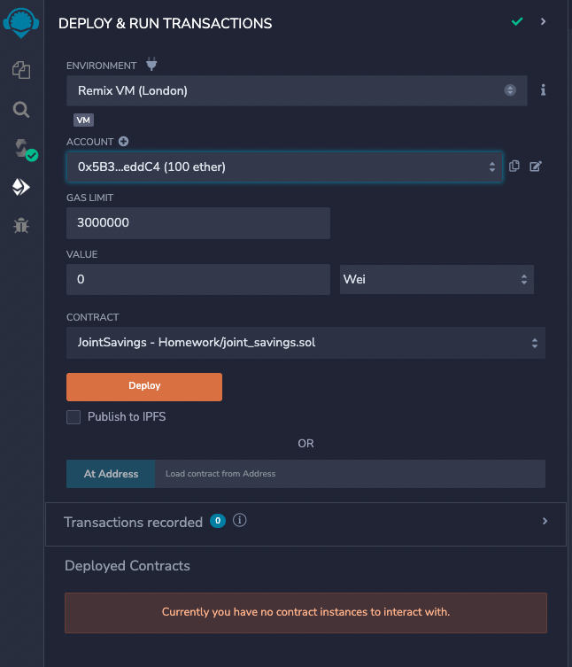
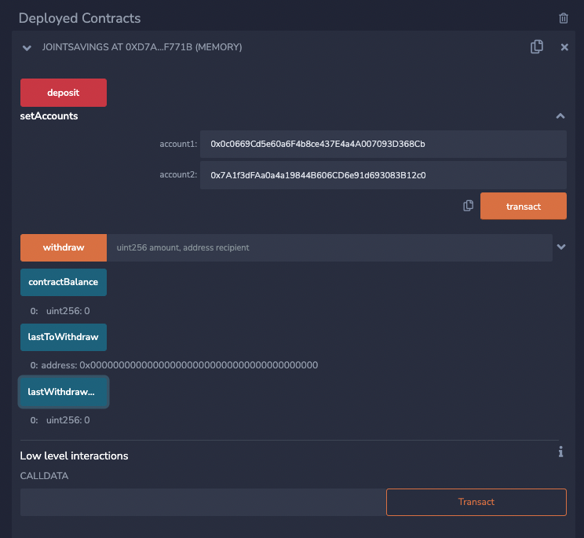
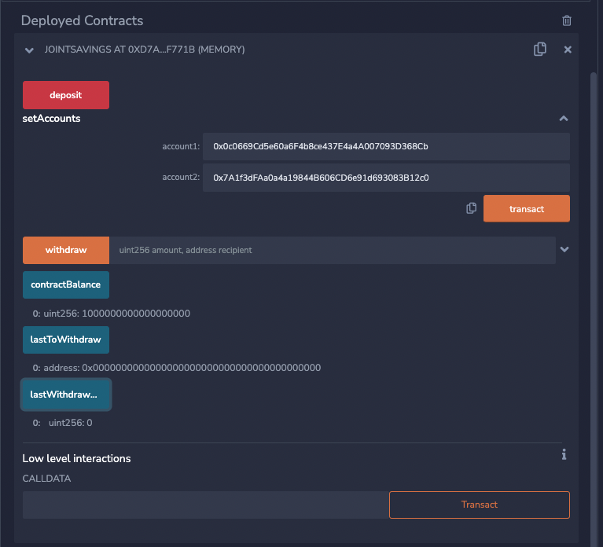
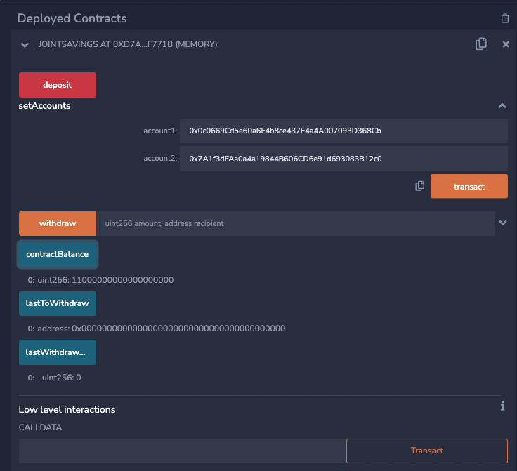
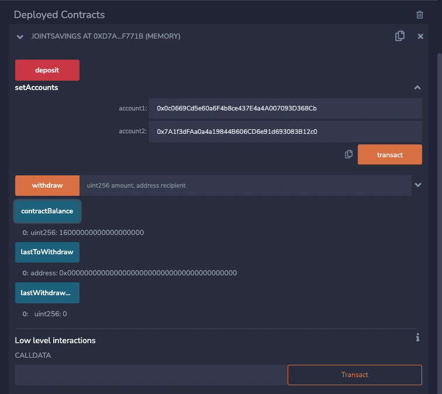
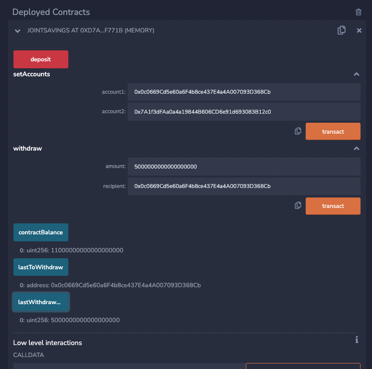
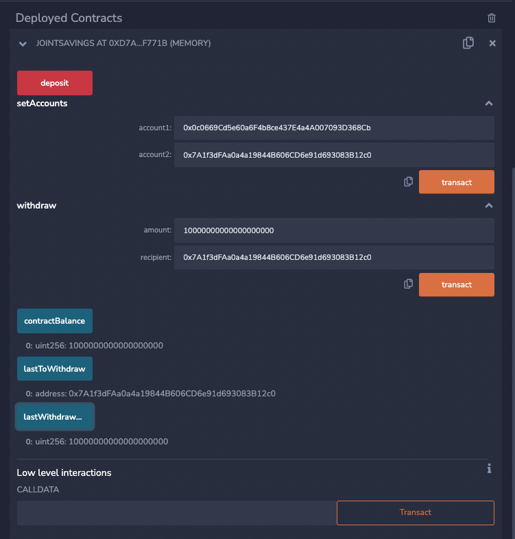

# Joint Savings Account using Smart Contract

This Solidity smart contract will automate the creation of joint savings account that accepts two user addresses. These addresses are then able to control a joint savings account. It uses ether management functions to implement a financial institution's requirements for providing the features of the joint savings account. It has the ability to deposit and withdraw funds fron the account. 

## Interacting with the deployed smart contract

### Deploying the contract



### Setup Accounts



### Deposit 1 ether



### Deposit 10 ether



### Deposit 5 ether


### Withdraw 5 ether to Account 1



### Withdraw 10 ether to Account 2



## Technologies 
* [Remix](https://remix.ethereum.org/) - Remix is a browser-based compiler and IDE that enables users to build Ethereum contracts with Solidity language and to debug transactions.

* [Solidity](https://docs.soliditylang.org/) - Solidity is an object-oriented, high-level language for implementing smart contracts. Smart contracts are programs which govern the behaviour of accounts within the Ethereum state.

## Usage

Please download the project or clone the project using git clone

Please launch remix by typing the following on the browser:

```python
https://remix.ethereum.org/
```
## Contributors

Suraj Shrestha (surajstha465@gmail.com)


